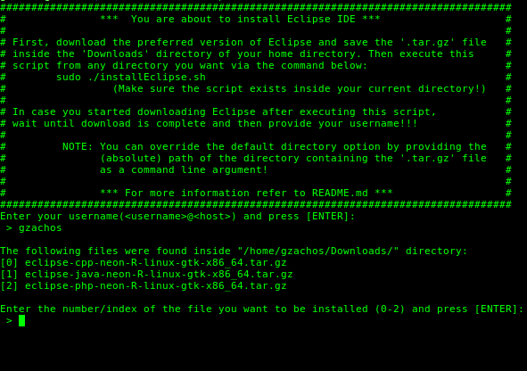

eclipse-debian-installer
============

A Bourne Shell script that will install Eclipse IDE, after you download it from [eclipse.org](http://eclipse.org/downloads/?osType=linux).

Operating System
----
LINUX // Debian-based distributions<br>
(Developed on Debian 8 Jessie)


Shell
-----
- Bourne shell (sh)

Developer
-----
George Z. Zachos

Licence
-----
[GNU GENERAL PUBLIC LICENSE // Version 2, June 1991](LICENSE)

Note
-----
This script was developed in order to cover personal needs and it is by no mean guaranteed to work properly on every computer.

Execution
-----
There are two ways that you can execute the script.

 * __1st way__:
```Shell
sudo ./installEclipse
```
In order to use this command, you have to download the eclipse '_.tar.gz_' file of your choice from _eclipse.org_
and save it inside the __Downloads__ directory of your account. After download is finished, run the command.
During execution you will be asked to enter your _username_ (username@host), in order for the script to enter
/home/_username_/Downloads/ and search for the '_.tar.gz_' file to be installed.

 * __2nd way__:
```Shell
sudo ./installEclipse <absolute-path-of-directory>
```
By executing the script in such a way, you have to give the __absolute__ path of the directory where the eclipse
'_.tar.gz_' file is saved as a command line argument.
__NOTE that the absolute path should end with a forward slash__ ( __/__ ).
The script will enter the directory given as an argument and will search for the '_.tar.gz_' file to be installed.<br><br>

Command example:
```Shell
sudo ./installEclipse /home/gzachos/Desktop/
```
<br>
In __both__ ways, if there are more than one '_.tar.gz_' files inside the specified directory, you will be prompted
just like it is shown in the screenshot below, to choose the one you want to be installed.<br><br>
e.g.<br>

